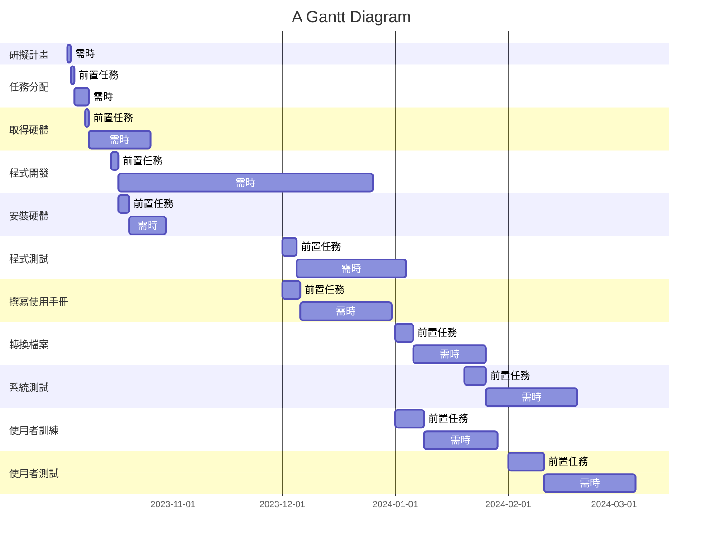

# 專案管理

## 甘特圖

```mermaid
gantt
    title A Gantt Diagram

    section 研擬計畫
    需時               :2023-10-03, 1d
    section 任務分配
    前置任務            :2023-10-04  , 1d
    需時               : 4d
    section 取得硬體
    前置任務            :2023-10-08  , 1d
    需時               : 17d
    section 程式開發
    前置任務            :2023-10-15  , 2d
    需時               : 70d
    section 安裝硬體
    前置任務            :2023-10-17  , 3d
    需時               : 10d
    section 程式測試
    前置任務            :2023-12-01  , 4d
    需時               : 30d
    section 撰寫使用手冊
    前置任務            :2023-12-01  , 5d
    需時               : 25d
    section 轉換檔案
    前置任務            :2024-01-01  , 5d
    需時               : 20d
    section 系統測試
    前置任務            :2024-01-20  , 6d
    需時               : 25d
    section 使用者訓練
    前置任務            :2024-01-01  , 8d
    需時               : 20d
    section 使用者測試
    前置任務            :2024-02-01  , 10d
    需時               : 25d
```

## PERT/CPM 圖

## 關鍵路徑
